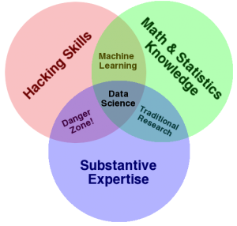

```{r setup, echo=FALSE, message=FALSE}
library(tidyverse)
library(modelr)

df_data <-
  read_csv("~/Sync/data/shoe_size/wo_men.csv")

# Common theme settings
theme_common <- function() {
  theme_minimal() %+replace%
  theme(
    axis.text.x = element_text(size = 12),
    axis.text.y = element_text(size = 12),
    axis.title.x = element_text(margin = margin(4, 4, 4, 4), size = 16),
    axis.title.y = element_text(margin = margin(4, 4, 4, 4), size = 16, angle = 90),

    aspect.ratio = 4 / 4,

    plot.margin   = unit(c(t = +0, b = +0, r = +0, l = +0), "cm"),
    panel.spacing = unit(c(t = +0, b = +0, r = +0, l = +0), "cm"),

    legend.text = element_text(size = 10),

    panel.grid.major = element_line(color = "grey90"),
    panel.grid.minor = element_line(color = "grey90")
  )
}
```

# Data Science
<!-- -------------------------------------------------- -->

## What Even Is "Data Science"?

```{r, echo=FALSE, out.width = "55%"}

```

C.C. Drew Conway
