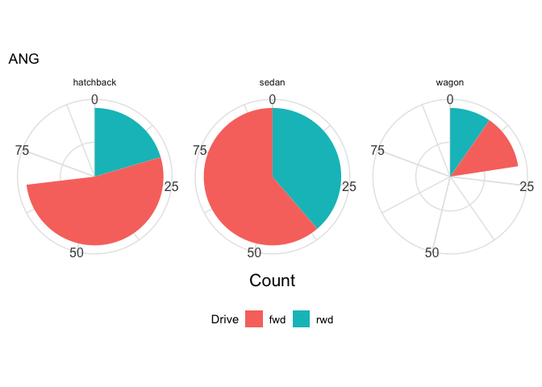
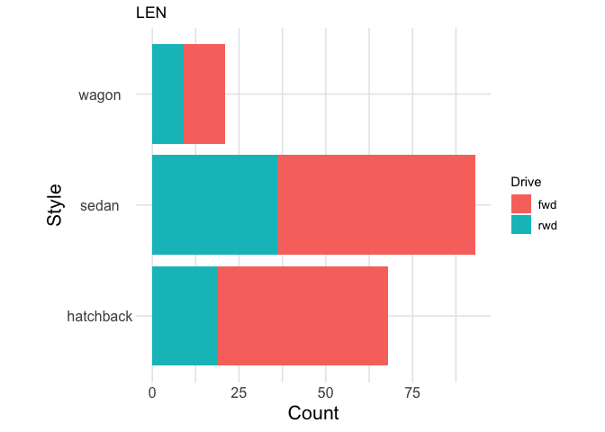
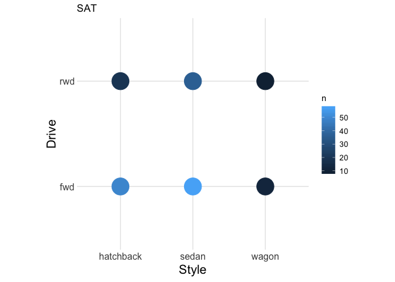
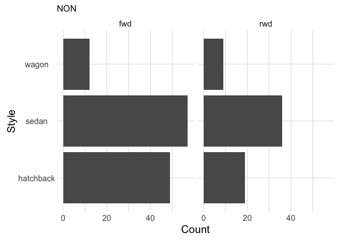
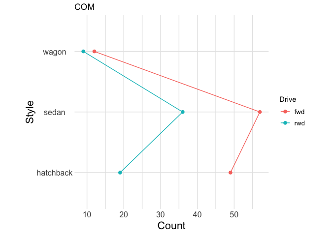
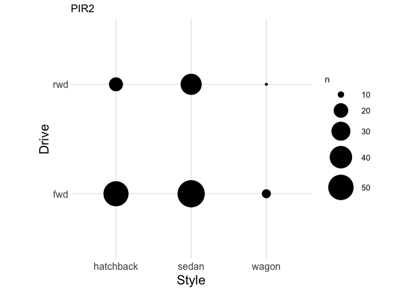

The Visual Hierarchy
================
Zach
2019-02-16

The following document is a handout-worksheet version of the "Visual
Hierarchy activity. While this is a workable way to run this activity, I
suggest printing cards from `grid.pdf` and separating the individual
figures. This will allow students to more easily sort the cards. The
instructions on this sheet are still useful for prompting students,
though.

In this lesson, we will illustrate different methods of visualizing
information. The purpose of this exercise is to determine which methods
are the most effective – in terms of ‘ease of interpretation.’ You will
rank a number of different visualizations – of the same data – in terms
of how easily you can draw comparisons. This will lead to prescriptive
suggestions about constructing visualizations, which will be useful when
designing graphics.

The visual hierarchy was proposed by (Cleveland and McGill 1985) in
1985. The concept is that certain *perceptual tasks* – small components
of interpreting graphics – require more or less effort on the part of
the viewer. Easier tasks are more result in a more readable
visualization of data; since our goal should be to both learn and
communicate information as clearly as possible, easier tasks are better
tasks.

Their hierarchy, in order of descending ease, is:

1.  Position along a common scale
2.  Position on identical but nonaligned scales
3.  Length
4.  Angle; Slope\[1\]
5.  Area
6.  Volume; Density; Color saturation
7.  Color hue

## Define figures for different tasks

See code in `master.Rmd`….

### Plot all visual tasks figures

The following six figures all show identical data – they each depict a
dataset detailing attributes about different models of car. Each
observation in the dataset is a single model of vehicle; the attributes
depicted below are the Drive style (Forward Wheel Drive (`fwd`) and Rear
Wheel Drive (`rwd`)) and Body style (`hatchback`, `sedan`, or `wagon`).
Each figure depicts the number of cars that fall into each category; for
instance, the number of cars in the dataset that are both `fwd` and
`hatchback`.

**Complete the following tasks:**

1.  For each visualization, describe *how information is visually
    encoded.* Is information shown via shape, position, color, size, or
    something else?
2.  Answer the question “Which is larger: The count of `wagons` with
    `fwd` Drive OR the count of `wagons` with `rwd` Drive? By how much
    is one larger than the other?”
3.  Rank the following visualizations *in terms of how well they help
    you answer question (2) above.* Rate the most helpful visualization
    as 1, and the least helpful as 6; do not allow ties between
    visualizations.

<!-- end list -->

``` r
df_figs %>% pull(fig)
```

    ## [[1]]

<!-- -->

    ## 
    ## [[2]]

<!-- -->

    ## 
    ## [[3]]

<!-- -->

    ## 
    ## [[4]]

<!-- -->

    ## 
    ## [[5]]

<!-- -->

    ## 
    ## [[6]]

<!-- -->

<div id="refs" class="references">

<div id="ref-cleveland1985graphical">

Cleveland, William S, and Robert McGill. 1985. “Graphical Perception and
Graphical Methods for Analyzing Scientific Data.” *Science* 229 (4716).
American Association for the Advancement of Science: 828–33.

</div>

</div>

1.  With slope not too close to 0, \(\pi/2\), or \(\pi\).
